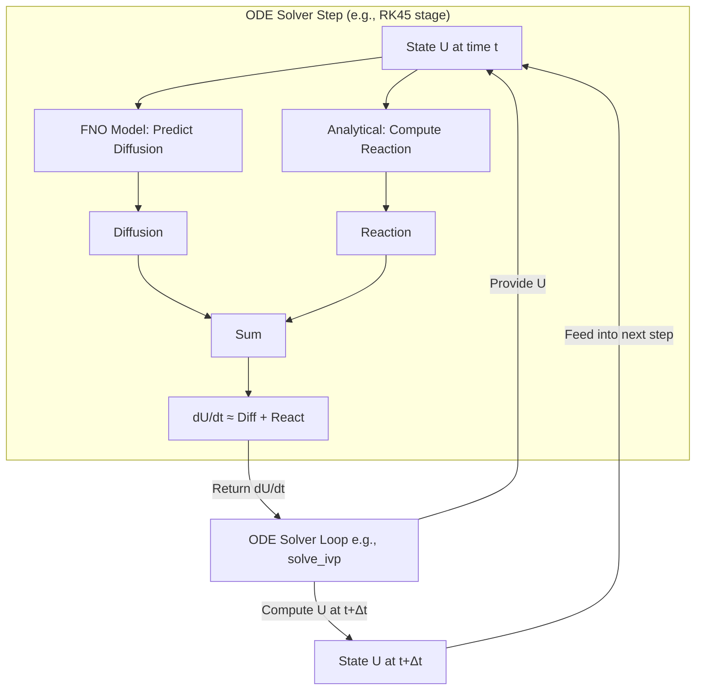

# Gray-Scott Pattern Formation with Hybrid FNO Neural Operator


## Overview:

This repository implements a **hybrid neural operator** approach for simulating the Gray-Scott reaction-diffusion system, combining:
- Fourier Neural Operator (FNO) for learning the diffusion dynamics
- Analytical computation of reaction terms
- Traditional ODE integration for time-stepping

## Key features:

-  Neural operator learns only the complex diffusion dynamics
-  Analytical reaction terms preserve known physics
-  Adaptive time-stepping through scipy's `solve_ivp`
-  GPU-accelerated training via PyTorch
-  Comparative visualization against ground truth solutions

## Installation:

```bash
conda create -n fno python=3.9
conda activate fno
pip install -r requirements.txt
```
## Requirements:

- Python 3.9+

- PyTorch 2.0+

- scipy

- matplotlib

- tqdm

- numpy

## Usage (with example parameters):

### 1. Generate Training Data

```bash
python generate_data.py --nx 128 --ny 128 --t_end 10000 --frames 1000
```
### 2. Train the FNO Model 
```bash
python train.py \
    --modes 36 \
    --width 64 \
    --epochs 150 \
    --batch_size 4 \
    --lr 5e-5
```

### 3. Run Hybrid Simulation

```bash
python simulate.py \
    --model_path best_model.pth \
    --t_end 10000 \
    --frames 1000
```
## Key Parameters

| Parameter   | Default | Description                        |
|-------------|---------|------------------------------------|
| `Du`        | 2e-5    | Diffusion coefficient (U)          |
| `Dv`        | 1e-5    | Diffusion coefficient (V)          |
| `F`         | 0.0545  | Feed rate parameter                |
| `k`         | 0.062   | Kill rate parameter                |
| `NX`, `NY`  | 128     | Spatial resolution                 |
| `FNO_MODES` | 36      | Fourier modes in FNO               |
| `FNO_WIDTH` | 64      | Channel width in FNO               |


## Methodology: ODE Solver Integration

### Hybrid FNO + Reaction Model within ODE Solver



## Training Process

1. Generate ground truth trajectories
2. Compute analytical reaction terms
3. Train FNO to predict only diffusion components
4. Validate on held-out simulation data

## Key Takeaways

*   Directly learning the full PDE dynamics with an FNO for complex, pattern-forming systems like Gray-Scott is challenging for achieving long-term stable and accurate simulations within a Neural ODE framework.
*   The **Hybrid approach**, where the FNO learns the spatial derivative terms (like diffusion) and known analytical terms (like reaction) are computed separately, offers a much more robust and accurate pathway.
*   Integrating learned, time-independent operators (like the FNO diffusion operator) with classical ODE solvers (via the Neural ODE formulation) is crucial for stability and leveraging established numerical methods, aligning with the goal of improving upon fixed-step autoregressive schemes.
*   Achieving perfect quantitative agreement with ground truth over very long times remains a challenge due to inherent approximation errors in the learned operator (even just the diffusion part), but the qualitative and medium-term quantitative accuracy can be substantially improved with the hybrid method.
  


    

    

